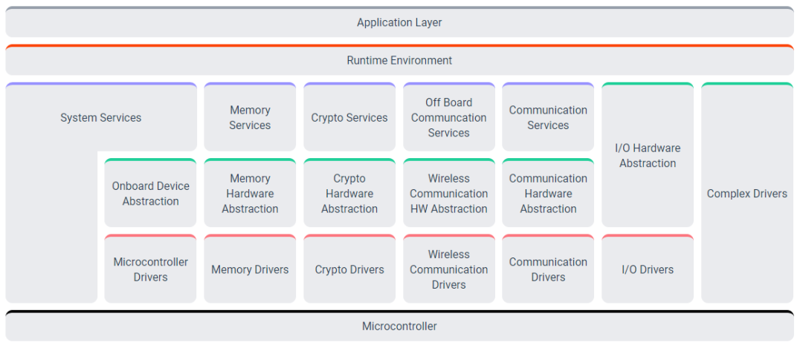

## 索引

## Autosar 是什么
autosar 有两个版本 autosar classic platform 覆盖了低端设备 adaptive platform 面向更上层的系统和服务

## Autosar 的标准化
autosar 通过以下内容做了标准化
+ 软件接口
+ 交换格式
+ 方法论

## Classic Platform

Autosar classic 平台体系结构在运行在 微控制器 上的三层软件层之间的最高抽象层上所有区别：应用程序(Application), 运行时环境(RTE)和基本软件(BSW)

## 我的经历

我们开发autosar只进行了部分模块的修改
1. 通信模块 使用autosar的com模块和PDU Router 来处理CAN和以太网通信
2. 诊断模块 使用 autosar 的Dcm模块来实现UDS诊断服务，方便与其他ECU进行标准化的诊断通信
3. 应用逻辑 使用非autosar代码，
4. 网络管理： 使用autosar的Nm模块进行网络管理，确保雷达ECU在车辆网络中正确的工作

### autosar 的 UDS 开发
1. 配置 COM 模块：定义需要传输的UDS信号
2. 配置 PDU Router 模块用于来处理UDS消息
3. 配置Dcm (Diagnostic Communication Manager) 模块处理诊断通信，包括UDS服务
4. 使用Vector DaVinci 生成配置好的基础软件代码
5. 将生成的代码集成到ECU的应用程序中，并实现具体的UDS服务处理逻辑
6. 配置CAN通信，包括CAN Driver， Can interface
7. 使用CANoe验证测试

